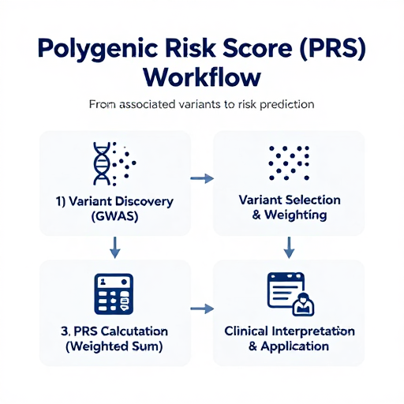

# Literature Review: Polygenic Risk Scores (PRS) in Precision Medicine

## Overview

This repository contains a comprehensive literature review on **Polygenic Risk Scores (PRS)** and their role in precision medicine. The review explores how PRS are constructed, interpreted, and applied in clinical settings, while also addressing critical challenges including population stratification, ethical considerations, and future directions.

> This mini-portfolio project demonstrates skills in:
> - Scientific writing and literature synthesis
> - Understanding of complex genetic concepts (GWAS, PRS)
> - Critical evaluation of genomic technologies
> - Communication of precision medicine topics

---

## Figure

### PRS Workflow

*Figure 1. Polygenic Risk Score (PRS) workflow. From variant discovery in GWAS to clinical interpretation and risk stratification.*

---

## Abstract

Polygenic Risk Scores (PRS) represent a significant advancement in precision medicine, leveraging vast genomic datasets to quantify an individual's genetic predisposition to complex diseases. This review provides a concise overview of PRS, detailing their construction through the aggregation of small effect variants across the genome. We discuss the interpretation of these scores in the context of individual risk and their emerging clinical applications, such as disease prediction and risk stratification.

**Keywords:** Polygenic Risk Score (PRS), Precision Medicine, Genomics, Risk Prediction, Genetic Predisposition, Population Stratification, Ancestry

---

## Key Topics Covered

| Topic | Description |
|-------|-------------|
| **Introduction to PRS** | Definition and role in precision medicine |
| **PRS Construction** | GWAS discovery, variant selection, effect size weighting |
| **Interpretation** | Percentiles, risk stratification, comparison to reference populations |
| **Clinical Applications** | Disease prediction, risk stratification, therapeutic guidance |
| **Limitations** | Ancestry gap, missing heritability, predictive power |
| **Ethical Challenges** | Data privacy, discrimination, misinterpretation |
| **Future Directions** | Multi-omics integration, machine learning, clinical frameworks |

---

## Clinical Applications Discussed

- ✅ Early disease prediction and prevention
- ✅ Risk stratification for personalized management
- ✅ Therapeutic guidance (drug selection/response)
- ✅ Population health management

---

## Limitations Addressed

| Limitation | Explanation |
|------------|-------------|
| **Ancestry gap** | PRS from European GWAS perform poorly in non-European populations |
| **Missing heritability** | Current PRS explain only a small proportion of phenotypic variance |
| **Environmental factors** | Lifestyle and exposures not yet integrated |
| **Misinterpretation** | Risk ≠ destiny; communication challenges |

---

## Ethical Considerations

- Ancestry and population stratification
- Data privacy and security
- Potential for discrimination (insurance, employment)
- Need for regulatory frameworks

## Future Directions

- Improving PRS accuracy across diverse ancestries
- Integrating multi-omics data (transcriptomics, proteomics, metabolomics)
- Developing dynamic PRS (evolving over lifetime)
- Establishing clinical implementation frameworks
- Machine learning for non-linear interactions

